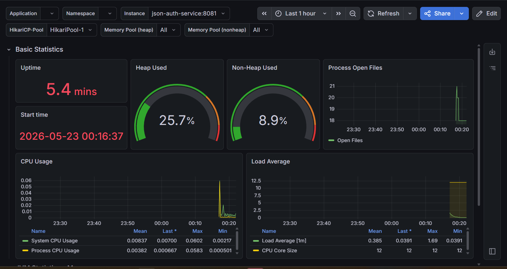

# Auth Service B9 - JSON

## Analisis Improvement dari Profiling
Hasil profiling menggunakan Docker di bawah beban konkurensi tinggi menunjukkan endpoint GET /list mengalami bottleneck dengan waktu respons mencapai 1.350 ms. 
Penyebab utamanya adalah pemanggilan authService.findAllUsers(status) yang menarik seluruh data pengguna ke memori sekaligus, sehingga implementasi pagination sangat krusial 
untuk memangkas beban memori dan serialisasi data. Selain itu, optimasi di layer repository perlu dilakukan dengan menerapkan JOIN FETCH atau @EntityGraph untuk menghindari masalah N+1 Query, 
serta menambahkan index pada kolom database yang sering diakses (seperti status) untuk mencegah Full Table Scan saat volume data membesar.

Di sisi infrastruktur, tingginya latensi tersebut juga sangat dipengaruhi oleh konfigurasi connection pool (HikariCP) bawaan Spring Boot yang membatasi maksimal hanya 10 koneksi aktif secara bersamaan. 
Saat aplikasi menerima lonjakan request, mayoritas request akan tertahan di dalam antrean panjang hanya untuk menunggu akses ke database yang kosong, sehingga menciptakan waktu tunggu artifisial yang signifikan. 
Oleh karena itu, melakukan tuning dengan menaikkan batas maksimal connection pool pada konfigurasi aplikasi menjadi langkah yang tepat agar sistem dapat memproses beban kerja tinggi secara lebih stabil, cepat, dan responsif.

## Monitoring
